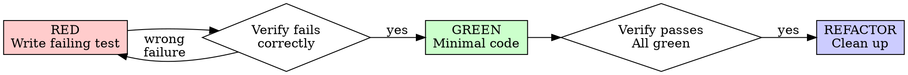
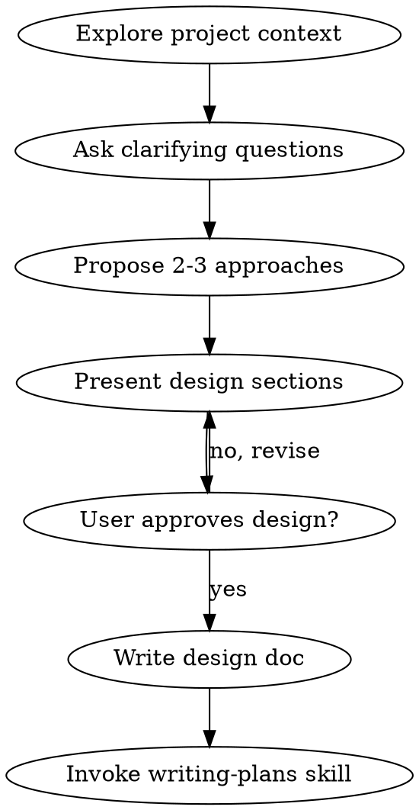
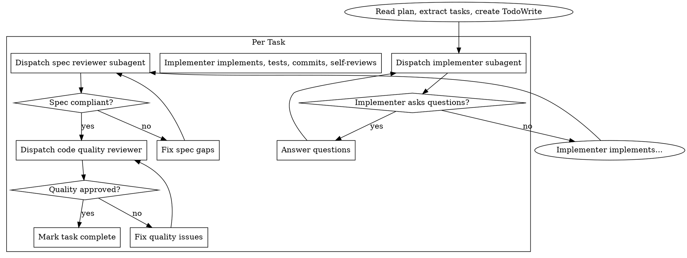
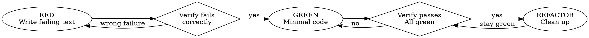

第二部呢# Superpowers 项目学习指南

> 本文档深入解析 Superpowers 项目的提示词设计和技能系统，帮助你理解如何编写高质量的 AI 代理指令。

---

## 目录

1. [项目概述](#1-项目概述)
2. [技能系统架构](#2-技能系统架构)
3. [提示词设计核心原则](#3-提示词设计核心原则)
4. [核心技能提示词深度解析](#4-核心技能提示词深度解析)
5. [完整工作流串联](#5-完整工作流串联)
6. [技能测试方法论](#6-技能测试方法论)
7. [最佳实践总结](#7-最佳实践总结)

---

## 1. 项目概述

### 1.1 什么是 Superpowers？

Superpowers 是一个完整的软件开发工作流系统，构建在一组可组合的"技能"(Skills) 之上。它的核心理念是：

> **让 AI 代理不要急于写代码，而是先理解需求、设计方案、制定计划，然后系统化地执行。**

### 1.2 核心工作流

```
想法 → 头脑风暴 → 设计文档 → 实现计划 → 子代理执行 → 代码审查 → 完成部署
```

### 1.3 支持的平台

| 平台 | 安装方式 |
|------|----------|
| Claude Code | 插件市场安装 |
| Cursor | 插件市场安装 |
| Codex | 手动配置 |
| OpenCode | 手动配置 |

### 1.4 核心理念

- **测试驱动开发 (TDD)** - 先写测试，永远如此
- **系统化优于临时性** - 流程优于猜测
- **降低复杂性** - 简洁是首要目标
- **证据优于声明** - 验证后再宣布成功

---

## 2. 技能系统架构

### 2.1 目录结构

```
skills/
  skill-name/
    SKILL.md              # 主文件（必需）
    supporting-file.*     # 辅助文件（按需）
```

### 2.2 SKILL.md 标准结构

```markdown
---
name: skill-name-with-hyphens
description: Use when [specific triggering conditions and symptoms]
---

# Skill Name

## Overview
一句话说明这是什么，核心原则。

## When to Use
使用条件和决策流程图。

## Core Pattern / The Process
核心流程或模式说明。

## Quick Reference
快速参考表格或列表。

## Common Mistakes / Red Flags
常见错误和警告信号。

## Example
具体示例。
```

### 2.3 YAML Frontmatter 规范

**只有两个字段：**

| 字段 | 限制 | 说明 |
|------|------|------|
| `name` | 64 字符 | 仅使用字母、数字、连字符 |
| `description` | 1024 字符 | 描述**何时使用**，而非**做什么** |

**description 写法要点：**

```yaml
# ❌ 错误：总结了工作流程
description: Use when executing plans - dispatches subagent per task with code review

# ✅ 正确：只描述触发条件
description: Use when executing implementation plans with independent tasks in the current session
```

> **关键发现**：测试表明，当 description 总结了工作流程时，AI 可能只遵循 description 而不阅读完整的技能内容。只写触发条件可以强制 AI 去阅读完整的技能文档。

### 2.4 渐进式披露模式

技能内容按需加载，不在启动时全部读入：

```
启动时：只加载所有技能的 name + description（元数据）
使用时：读取 SKILL.md 主文件
深入时：按需读取辅助参考文件
```

**文件组织建议：**

```
pdf-skill/
├── SKILL.md              # 主入口（< 500 行）
├── FORMS.md              # 表单填充指南
├── reference.md          # API 参考
└── scripts/
    ├── analyze_form.py   # 可执行脚本
    └── fill_form.py      # 可执行脚本
```

### 2.5 Claude 搜索优化 (CSO)

让 AI 能够发现你的技能：

1. **Rich Description Field** - 包含具体触发条件、症状、场景
2. **Keyword Coverage** - 使用 AI 会搜索的关键词
3. **Descriptive Naming** - 动词优先，如 `writing-skills` 而非 `skill-writing`

---

## 3. 提示词设计核心原则

### 3.1 说服心理学应用

Superpowers 创造性地将 Cialdini 的说服心理学应用于 AI 指令设计。研究表明，这些技术可以将 AI 的合规率从 33% 提升到 72%。

#### 七大说服原则

| 原则 | 在技能中的应用 | 示例 |
|------|----------------|------|
| **Authority (权威)** | 使用祈使语气："YOU MUST", "Never", "Always" | `Write code before test? Delete it. Start over. No exceptions.` |
| **Commitment (承诺)** | 要求明确声明、强制选择、跟踪检查 | `Announce at start: "I'm using [Skill Name]"` |
| **Scarcity (稀缺)** | 时间限制、顺序依赖 | `IMMEDIATELY request code review before proceeding` |
| **Social Proof (社会认同)** | 通用模式、失败案例 | `Checklists without TodoWrite tracking = steps get skipped. Every time.` |
| **Unity (统一)** | 协作语言、共同目标 | `We're colleagues working together` |
| Reciprocity | 谨慎使用 | - |
| Liking | **避免使用** | - |

#### 按技能类型选择原则

| 技能类型 | 使用 | 避免 |
|----------|------|------|
| 纪律强制型 | Authority + Commitment + Social Proof | Liking, Reciprocity |
| 指导/技术型 | 适度 Authority + Unity | Heavy authority |
| 协作型 | Unity + Commitment | Authority, Liking |
| 参考型 | 只需清晰 | 所有说服技术 |

### 3.2 防理性化设计

AI 在压力下会寻找漏洞和借口。Superpowers 使用多种技术来防止这种情况。

#### Iron Law（铁律）

在每个纪律强制型技能中设置不可违反的规则：

```markdown
## The Iron Law

NO PRODUCTION CODE WITHOUT A FAILING TEST FIRST

Write code before the test? Delete it. Start over.

**No exceptions:**
- Don't keep it as "reference"
- Don't "adapt" it while writing tests
- Don't look at it
- Delete means delete
```

#### Common Rationalizations Table（常见理性化表格）

列出 AI 可能使用的借口和反驳：

```markdown
| Excuse | Reality |
|--------|---------|
| "Too simple to test" | Simple code breaks. Test takes 30 seconds. |
| "I'll test after" | Tests passing immediately prove nothing. |
| "Already manually tested" | Ad-hoc ≠ systematic. No record, can't re-run. |
| "Deleting X hours is wasteful" | Sunk cost fallacy. Keeping unverified code is technical debt. |
```

#### Red Flags（红旗警告）

列出必须停止的信号：

```markdown
## Red Flags - STOP and Start Over

- Code before test
- "I already manually tested it"
- "Tests after achieve the same purpose"
- "It's about spirit not ritual"
- "Keep as reference" or "adapt existing code"

**All of these mean: Delete code. Start over with TDD.**
```

### 3.3 流程图使用

Superpowers 使用 Graphviz DOT 格式的流程图来可视化决策流程：

**何时使用流程图：**
- 非显而易见的决策点
- 可能过早停止的循环流程
- "何时使用 A vs B" 的决策

**何时不使用流程图：**
- 参考材料 → 用表格、列表
- 代码示例 → 用 Markdown 代码块
- 线性指令 → 用编号列表

**示例流程图：**



### 3.4 结构化对比：Good vs Bad

使用对比来明确期望：

```markdown
<Good>
```typescript
test('retries failed operations 3 times', async () => {
  let attempts = 0;
  const operation = () => {
    attempts++;
    if (attempts < 3) throw new Error('fail');
    return 'success';
  };

  const result = await retryOperation(operation);

  expect(result).toBe('success');
  expect(attempts).toBe(3);
});
```
Clear name, tests real behavior, one thing
</Good>

<Bad>
```typescript
test('retry works', async () => {
  const mock = jest.fn()
    .mockRejectedValueOnce(new Error())
    .mockResolvedValueOnce('success');
  await retryOperation(mock);
  expect(mock).toHaveBeenCalledTimes(3);
});
```
Vague name, tests mock not code
</Bad>
```

---

## 4. 核心技能提示词深度解析

### 4.1 Brainstorming（头脑风暴）

**文件位置：** `skills/brainstorming/SKILL.md`

**触发条件：** 任何创造性工作之前 - 创建功能、构建组件、添加功能或修改行为。

#### 核心设计思想

这个技能强制 AI 在写代码之前先理解需求。使用苏格拉底式对话，一次问一个问题。

#### 完整流程



#### 关键检查清单

```markdown
1. **Explore project context** — 检查文件、文档、最近提交
2. **Ask clarifying questions** — 一次一个问题，理解目的/约束/成功标准
3. **Propose 2-3 approaches** — 包含权衡和推荐
4. **Present design** — 按复杂度分段呈现，每段后获取批准
5. **Write design doc** — 保存到 `docs/plans/YYYY-MM-DD-<topic>-design.md`
6. **Transition to implementation** — 调用 writing-plans 技能
```

#### HARD-GATE 设计

```markdown
<HARD-GATE>
Do NOT invoke any implementation skill, write any code, scaffold any project, 
or take any implementation action until you have presented a design and the 
user has approved it. This applies to EVERY project regardless of perceived simplicity.
</HARD-GATE>
```

#### 反模式警告

```markdown
## Anti-Pattern: "This Is Too Simple To Need A Design"

Every project goes through this process. A todo list, a single-function utility, 
a config change — all of them. "Simple" projects are where unexamined assumptions 
cause the most wasted work.
```

---

### 4.2 Writing Plans（编写计划）

**文件位置：** `skills/writing-plans/SKILL.md`

**触发条件：** 当你有规格或需求需要多步骤任务时，在接触代码之前。

#### 核心设计思想

编写详细的实现计划，假设执行者是一个"热情但品味不佳、没有判断力、没有项目上下文、不喜欢测试的初级工程师"。

#### 任务粒度原则

**每个步骤是一个动作（2-5 分钟）：**

```markdown
- "Write the failing test" - 一个步骤
- "Run it to make sure it fails" - 一个步骤
- "Implement the minimal code to make the test pass" - 一个步骤
- "Run the tests and make sure they pass" - 一个步骤
- "Commit" - 一个步骤
```

#### 计划文档头部模板

```markdown
# [Feature Name] Implementation Plan

> **For Claude:** REQUIRED SUB-SKILL: Use superpowers:executing-plans to implement this plan task-by-task.

**Goal:** [One sentence describing what this builds]

**Architecture:** [2-3 sentences about approach]

**Tech Stack:** [Key technologies/libraries]

---
```

#### 任务结构模板

````markdown
### Task N: [Component Name]

**Files:**
- Create: `exact/path/to/file.py`
- Modify: `exact/path/to/existing.py:123-145`
- Test: `tests/exact/path/to/test.py`

**Step 1: Write the failing test**

```python
def test_specific_behavior():
    result = function(input)
    assert result == expected
```

**Step 2: Run test to verify it fails**

Run: `pytest tests/path/test.py::test_name -v`
Expected: FAIL with "function not defined"

**Step 3: Write minimal implementation**

```python
def function(input):
    return expected
```

**Step 4: Run test to verify it passes**

Run: `pytest tests/path/test.py::test_name -v`
Expected: PASS

**Step 5: Commit**

```bash
git add tests/path/test.py src/path/file.py
git commit -m "feat: add specific feature"
```
````

---

### 4.3 Subagent-Driven Development（子代理驱动开发）

**文件位置：** `skills/subagent-driven-development/SKILL.md`

**触发条件：** 在当前会话中执行具有独立任务的实现计划。

#### 核心设计思想

> **Fresh subagent per task + two-stage review (spec then quality) = high quality, fast iteration**

每个任务派发一个新的子代理，完成后进行两阶段审查：先审规格合规性，再审代码质量。

#### 完整流程图



#### 实现者提示词模板

```
Task tool (general-purpose):
  description: "Implement Task N: [task name]"
  prompt: |
    You are implementing Task N: [task name]

    ## Task Description

    [FULL TEXT of task from plan - paste it here, don't make subagent read file]

    ## Context

    [Scene-setting: where this fits, dependencies, architectural context]

    ## Before You Begin

    If you have questions about:
    - The requirements or acceptance criteria
    - The approach or implementation strategy
    - Dependencies or assumptions

    **Ask them now.** Raise any concerns before starting work.

    ## Your Job

    Once you're clear on requirements:
    1. Implement exactly what the task specifies
    2. Write tests (following TDD if task says to)
    3. Verify implementation works
    4. Commit your work
    5. Self-review
    6. Report back

    ## Before Reporting Back: Self-Review

    Review your work with fresh eyes:
    - Did I fully implement everything in the spec?
    - Is this my best work?
    - Did I avoid overbuilding (YAGNI)?
    - Do tests actually verify behavior?

    If you find issues during self-review, fix them now.
```

#### Red Flags

```markdown
**Never:**
- Start implementation on main/master branch without explicit user consent
- Skip reviews (spec compliance OR code quality)
- Proceed with unfixed issues
- Dispatch multiple implementation subagents in parallel (conflicts)
- Make subagent read plan file (provide full text instead)
- **Start code quality review before spec compliance is ✅** (wrong order)
```

---

### 4.4 Test-Driven Development（测试驱动开发）

**文件位置：** `skills/test-driven-development/SKILL.md`

**触发条件：** 实现任何功能或修复 bug 时，在编写实现代码之前。

#### 铁律

```markdown
## The Iron Law

NO PRODUCTION CODE WITHOUT A FAILING TEST FIRST

Write code before the test? Delete it. Start over.

**No exceptions:**
- Don't keep it as "reference"
- Don't "adapt" it while writing tests
- Don't look at it
- Delete means delete
```

#### Red-Green-Refactor 循环



#### 各阶段详解

**RED - 编写失败的测试**
```typescript
test('retries failed operations 3 times', async () => {
  let attempts = 0;
  const operation = () => {
    attempts++;
    if (attempts < 3) throw new Error('fail');
    return 'success';
  };

  const result = await retryOperation(operation);

  expect(result).toBe('success');
  expect(attempts).toBe(3);
});
```

**Verify RED - 观察它失败**
```bash
npm test path/to/test.test.ts
```
确认：
- 测试失败（不是错误）
- 失败消息是预期的
- 因为功能缺失而失败（不是拼写错误）

**GREEN - 编写最小代码**
```typescript
async function retryOperation<T>(fn: () => Promise<T>): Promise<T> {
  for (let i = 0; i < 3; i++) {
    try {
      return await fn();
    } catch (e) {
      if (i === 2) throw e;
    }
  }
  throw new Error('unreachable');
}
```

**REFACTOR - 清理**
- 移除重复
- 改进命名
- 提取辅助函数

#### 常见理性化表格

| Excuse | Reality |
|--------|---------|
| "Too simple to test" | Simple code breaks. Test takes 30 seconds. |
| "I'll test after" | Tests passing immediately prove nothing. |
| "Tests after achieve same goals" | Tests-after = "what does this do?" Tests-first = "what should this do?" |
| "Already manually tested" | Ad-hoc ≠ systematic. No record, can't re-run. |
| "Deleting X hours is wasteful" | Sunk cost fallacy. Keeping unverified code is technical debt. |

---

### 4.5 Systematic Debugging（系统化调试）

**文件位置：** `skills/systematic-debugging/SKILL.md`

**触发条件：** 遇到任何 bug、测试失败或意外行为时，在提出修复方案之前。

#### 铁律

```markdown
## The Iron Law

NO FIXES WITHOUT ROOT CAUSE INVESTIGATION FIRST

If you haven't completed Phase 1, you cannot propose fixes.
```

#### 四阶段流程

**Phase 1: Root Cause Investigation（根因调查）**

1. **仔细阅读错误消息** - 不要跳过错误或警告
2. **一致地重现** - 能可靠触发吗？确切步骤是什么？
3. **检查最近的更改** - Git diff、最近的提交、新依赖
4. **在多组件系统中收集证据**
5. **追踪数据流**

**Phase 2: Pattern Analysis（模式分析）**

1. 找到工作的示例
2. 与参考进行对比
3. 识别差异
4. 理解依赖关系

**Phase 3: Hypothesis and Testing（假设与测试）**

1. 形成单一假设
2. 最小化测试
3. 验证后再继续
4. 不知道时说"我不知道"

**Phase 4: Implementation（实现）**

1. 创建失败的测试用例
2. 实现单一修复
3. 验证修复
4. 如果修复不起作用：STOP，如果尝试了 3 次以上，质疑架构

#### Red Flags

```markdown
- "Quick fix for now, investigate later"
- "Just try changing X and see if it works"
- "Add multiple changes, run tests"
- "Skip the test, I'll manually verify"
- "It's probably X, let me fix that"
- **"One more fix attempt" (when already tried 2+)**
- **Each fix reveals new problem in different place**
```

---

### 4.6 Verification Before Completion（完成前验证）

**文件位置：** `skills/verification-before-completion/SKILL.md`

**触发条件：** 即将声称工作完成、已修复或通过时，在提交或创建 PR 之前。

#### 铁律

```markdown
## The Iron Law

NO COMPLETION CLAIMS WITHOUT FRESH VERIFICATION EVIDENCE

If you haven't run the verification command in this message, 
you cannot claim it passes.
```

#### 门控函数

```markdown
BEFORE claiming any status or expressing satisfaction:

1. IDENTIFY: What command proves this claim?
2. RUN: Execute the FULL command (fresh, complete)
3. READ: Full output, check exit code, count failures
4. VERIFY: Does output confirm the claim?
   - If NO: State actual status with evidence
   - If YES: State claim WITH evidence
5. ONLY THEN: Make the claim

Skip any step = lying, not verifying
```

#### 常见失败对照表

| Claim | Requires | Not Sufficient |
|-------|----------|----------------|
| Tests pass | Test command output: 0 failures | Previous run, "should pass" |
| Linter clean | Linter output: 0 errors | Partial check, extrapolation |
| Build succeeds | Build command: exit 0 | Linter passing, logs look good |
| Bug fixed | Test original symptom: passes | Code changed, assumed fixed |

#### Red Flags

```markdown
- Using "should", "probably", "seems to"
- Expressing satisfaction before verification ("Great!", "Perfect!", "Done!")
- About to commit/push/PR without verification
- Trusting agent success reports
- **ANY wording implying success without having run verification**
```

---

## 5. 完整工作流串联

### 5.1 从想法到部署

```
用户请求
    ↓
[brainstorming] 探索需求，提出方案
    ↓
设计文档 (docs/plans/YYYY-MM-DD-design.md)
    ↓
[writing-plans] 创建实现计划
    ↓
实现计划 (docs/plans/YYYY-MM-DD-plan.md)
    ↓
[using-git-worktrees] 创建隔离工作区
    ↓
[subagent-driven-development] 或 [executing-plans]
    ↓ (每个任务使用 TDD)
[test-driven-development] 红绿重构
    ↓
[requesting-code-review] 代码审查
    ↓
[verification-before-completion] 验证
    ↓
[finishing-a-development-branch] 完成分支
```

### 5.2 技能依赖关系

```
brainstorming
    └── writing-plans
            ├── using-git-worktrees
            ├── subagent-driven-development
            │       ├── test-driven-development
            │       ├── requesting-code-review
            │       └── finishing-a-development-branch
            └── executing-plans
                    ├── test-driven-development
                    └── finishing-a-development-branch
```

---

## 6. 技能测试方法论

### 6.1 TDD 应用于技能开发

> **创建技能就是将 TDD 应用于流程文档。**

| TDD 概念 | 技能创建 |
|----------|----------|
| **测试用例** | 带子代理的压力场景 |
| **生产代码** | 技能文档 (SKILL.md) |
| **测试失败 (RED)** | 没有技能时代理违反规则（基线） |
| **测试通过 (GREEN)** | 有技能时代理遵守规则 |
| **重构** | 封闭漏洞同时保持合规 |

### 6.2 铁律

```markdown
NO SKILL WITHOUT A FAILING TEST FIRST

Write skill before testing? Delete it. Start over.
```

### 6.3 RED-GREEN-REFACTOR for Skills

**RED Phase - 编写失败测试（基线）**

在没有技能的情况下运行压力场景，记录：
- 他们做了什么选择？
- 他们使用了什么理性化（逐字记录）？
- 哪些压力触发了违规？

**GREEN Phase - 编写最小技能**

编写解决那些特定理性化的技能。用技能运行相同场景。代理现在应该遵守了。

**REFACTOR Phase - 封闭漏洞**

代理找到了新的理性化？添加明确的反驳。重新测试直到无懈可击。

### 6.4 按技能类型的测试方法

| 技能类型 | 测试方法 | 成功标准 |
|----------|----------|----------|
| **纪律强制型** | 学术问题 + 压力场景 + 多重压力组合 | 代理在最大压力下遵守规则 |
| **技术型** | 应用场景 + 变体场景 + 缺失信息测试 | 代理成功应用技术到新场景 |
| **模式型** | 识别场景 + 应用场景 + 反例测试 | 代理正确识别何时/如何应用模式 |
| **参考型** | 检索场景 + 应用场景 + 差距测试 | 代理找到并正确应用参考信息 |

---

## 7. 最佳实践总结

### 7.1 提示词写作检查清单

**核心质量：**
- [ ] description 具体且包含关键词
- [ ] description 包含何时使用（不是做什么）
- [ ] SKILL.md 主体少于 500 行
- [ ] 附加细节在单独文件中（如需要）
- [ ] 没有时效性信息
- [ ] 全文术语一致
- [ ] 示例具体，不抽象
- [ ] 文件引用只有一层深度

**代码和脚本：**
- [ ] 脚本解决问题，而不是推给 Claude
- [ ] 错误处理明确且有帮助
- [ ] 没有"巫术常量"（所有值有理由）
- [ ] 必需的包在说明中列出

### 7.2 核心设计模式

1. **权威语言** - 使用 "YOU MUST", "Never", "Always"
2. **铁律** - 设置不可违反的规则
3. **理性化表格** - 列出借口和反驳
4. **Red Flags** - 必须停止的信号
5. **流程图** - 可视化复杂决策
6. **Good/Bad 对比** - 明确期望
7. **检查清单** - 跟踪多步骤流程

### 7.3 Token 效率技巧

- 移动细节到工具帮助（`--help`）
- 使用交叉引用而非重复
- 压缩示例
- 消除冗余

```bash
# 验证字数
wc -w skills/path/SKILL.md
# 入门工作流：目标 <150 词
# 其他常用技能：目标 <200 词
```

---

## 附录：关键文件索引

| 文件 | 用途 |
|------|------|
| `skills/writing-skills/SKILL.md` | 技能写作完整指南 |
| `skills/writing-skills/anthropic-best-practices.md` | Anthropic 官方最佳实践 |
| `skills/writing-skills/persuasion-principles.md` | 说服心理学应用 |
| `skills/brainstorming/SKILL.md` | 头脑风暴技能 |
| `skills/writing-plans/SKILL.md` | 计划编写技能 |
| `skills/subagent-driven-development/SKILL.md` | 子代理驱动开发 |
| `skills/subagent-driven-development/implementer-prompt.md` | 实现者提示词模板 |
| `skills/test-driven-development/SKILL.md` | TDD 技能 |
| `skills/systematic-debugging/SKILL.md` | 系统化调试 |
| `skills/verification-before-completion/SKILL.md` | 完成前验证 |
| `lib/skills-core.js` | 技能加载核心代码 |

---

*本文档基于 Superpowers 项目生成，用于学习提示词设计和技能系统。*